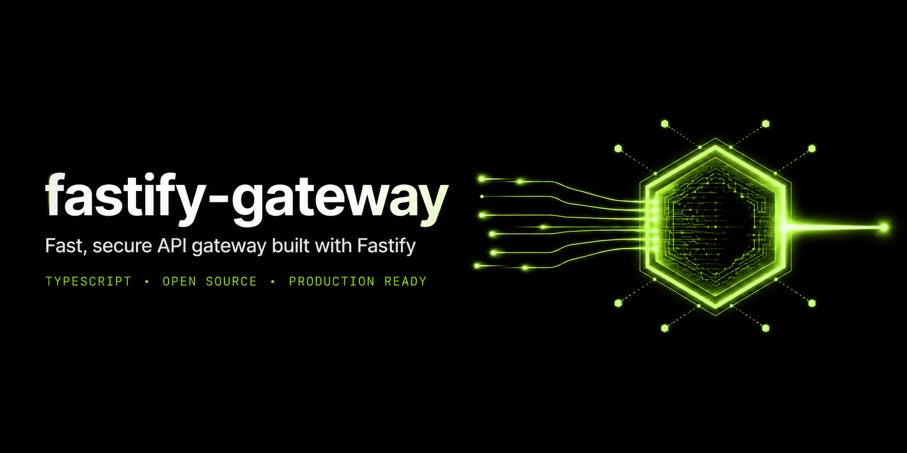
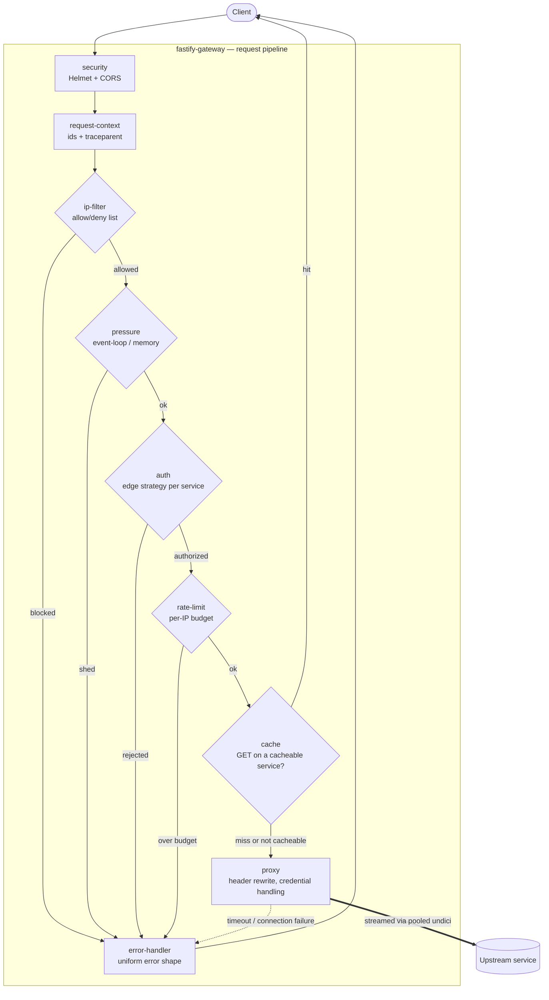

<p align="center">
  
</p>

# fastify-gateway

[](https://github.com/byshahriar/fastify-gateway/actions/workflows/ci.yml)

[](LICENSE)

A lightweight, extensible API gateway built on [Fastify](https://fastify.dev).
It authenticates requests at the edge, proxies them to upstream services with
fail-fast timeouts and connection pooling, and propagates distributed-tracing
context on every hop — all in a single small deployable.

## Why this gateway

- **Declarative services** — each upstream is a small class stating its prefix,
  upstream URL, and auth policy; shared proxy behavior lives in one base class
- **Pluggable edge auth** — API key, HTTP Basic, JWT (HMAC or JWKS), and Bearer
  (opaque-token introspection against your own auth service) built in; new
  schemes register through a strategy registry without touching existing code
- **Service-to-service auth** — the gateway presents its own credentials to
  upstreams, so client credentials never leak past the edge
- **Distributed tracing** — W3C `traceparent`, `x-request-id`, and
  `x-correlation-id` honored, generated, logged, and forwarded on every
  request, with optional OpenTelemetry span export
- **Rate limiting** — per-IP, in-memory or shared across replicas via Redis,
  with an optional escalating ban
- **Load shedding** — event-loop and memory pressure answered with
  `503` + `Retry-After` and reported on readiness; probes and metrics stay
  responsive
- **Response caching** — optional `Cache-Control`-aware caching for opted-in
  services, shared across replicas via Redis
- **IP filtering** — allow/deny lists with CIDR support, evaluated against
  the real client IP
- **Observability** — Prometheus metrics, structured multi-channel logs with
  optional single-line request logging and slow-request warnings, and
  optional Slack/Discord alerting on errors
- **Production posture** — schema-validated config that fails fast at boot,
  security headers, uniform error responses that never leak internals, bounded
  timeouts, and graceful shutdown with readiness draining
- **Feature-flagged extras** — Redis, caching, alerting, and OpenTelemetry
  are all opt-in and off by default, so nothing loads unless you enable it
- **Typed end to end** — strict TypeScript, with the config type derived from
  the validation schema itself

## Quick start

Requires Node.js >= 20.11.

```bash
npm install
cp .env.example .env    # set GATEWAY_API_KEY, BASIC_AUTH_USERS, upstream URLs
npm run start:dev
```

Try it:

```bash
curl localhost:8080/healthz
curl -H "x-api-key: change-me" localhost:8080/api/users/me     # API key service
curl -u admin:change-me        localhost:8080/api/orders/list  # Basic auth service
curl localhost:8080/api/public/status                          # public service
```

Or with Docker:

```bash
docker build -t fastify-gateway .
docker run --rm -p 8080:8080 --env-file .env fastify-gateway
```

`compose.yaml` also spins up three demo upstreams behind the gateway if you
want a working topology without wiring up real services:
`docker compose up --build`. See [Deployment](docs/deployment.md) for
Kubernetes and production notes, and [Getting Started](docs/getting-started.md)
for the full walkthrough.

## Architecture

Plugins register in a fixed order (`src/app.ts`); five of them **gate** the
request and can short-circuit the pipeline before it reaches a proxy:



`logging`, `redis`, `metrics`, and `alerts` observe every request without
gating it, and are omitted above for clarity. The full diagram set —
including the response-caching sequence and module-dependency graph — lives
in [Architecture](docs/architecture.md).

```
src/
├── app.ts          composition root — registration order lives here
├── config/         env schema (@fastify/env) + pre-schema factory options
├── core/
│   └── service-gateway.ts    abstract ServiceGateway + toPlugin() bridge
├── strategies/     edge auth strategies — api-key, basic, jwt, bearer
├── plugins/        cross-cutting concerns: security, auth, rate-limit,
│                   cache, ip-filter, pressure, metrics, alerts, …
├── routes/         what the gateway answers itself (health, /metrics)
└── gateways/       what the gateway forwards — one small class per upstream
```

Adding a new upstream is three small, additive steps with no existing files
touched — see [Extending](docs/extending.md).

## Configuration

Everything is environment-driven and schema-validated at boot — an invalid
or missing required value fails startup immediately, never at request time.
A representative slice (~70 variables total, all defaulted except
credentials):

| Variable | Default | Description |
| --- | --- | --- |
| `PORT` | `8080` | Listen port |
| `GATEWAY_API_KEY` | — | Shared secret for services using the `api-key` scheme |
| `BASIC_AUTH_USERS` | — | Comma-separated `username:password` pairs for the `basic` scheme |
| `TRUST_PROXY` | `true` | Resolve `req.ip` from `x-forwarded-for`; set `false` behind a direct client connection |
| `REDIS_URL` | — | Shared store backing rate limiting and response caching across replicas |
| `CACHE_ENABLED` | `false` | Feature flag for `Cache-Control`-aware response caching (requires `REDIS_URL`) |
| `IP_ALLOW_LIST` / `IP_DENY_LIST` | — | CIDR-aware allow/deny lists evaluated against the real client IP |
| `OTEL_ENABLED` | `false` | Feature flag for OpenTelemetry span export |
| `ALERTS_ENABLED` | `false` | Feature flag for Slack/Discord alerting on 5xx responses |

Full reference, including auth, observability, load-shedding, and rate-limit
variables: [Configuration](docs/configuration.md).

## Documentation

Full index: [docs/](docs/README.md).

| Guide | Contents |
| --- | --- |
| [Getting Started](docs/getting-started.md) | Install, configure, run, verify |
| [Architecture](docs/architecture.md) | Project layout, request lifecycle, design decisions |
| [Configuration](docs/configuration.md) | Every environment variable, defaults, validation |
| [Endpoints](docs/endpoints.md) | Routes the gateway serves and how it proxies |
| [Authentication](docs/authentication.md) | Edge schemes, upstream credentials, custom strategies |
| [Observability](docs/observability.md) | Request ids, trace propagation, logging, metrics |
| [Security Model](docs/security-model.md) | Trust boundaries and responsibilities |
| [Operations](docs/operations.md) | Error semantics, timeouts, rate limiting, scaling |
| [Deployment](docs/deployment.md) | Docker, Compose, and Kubernetes |
| [Troubleshooting](docs/troubleshooting.md) | Common problems and their causes |
| [Extending](docs/extending.md) | Adding services, override points, new auth schemes |
| [Testing](docs/testing.md) | Test layers, running, writing tests |

## Roadmap

What is shipped, what the platform owns, and what may come next:
[ROADMAP.md](ROADMAP.md).

## Contributing

Contributions are welcome — see [CONTRIBUTING.md](CONTRIBUTING.md) for the
development workflow and [CODE_OF_CONDUCT.md](CODE_OF_CONDUCT.md) for community
standards. Security issues should follow [SECURITY.md](SECURITY.md), not the
public issue tracker. Working with an AI coding agent? See
[AGENTS.md](AGENTS.md) for the tech stack, commands, and conventions it
should follow.

## License

[MIT](LICENSE)
