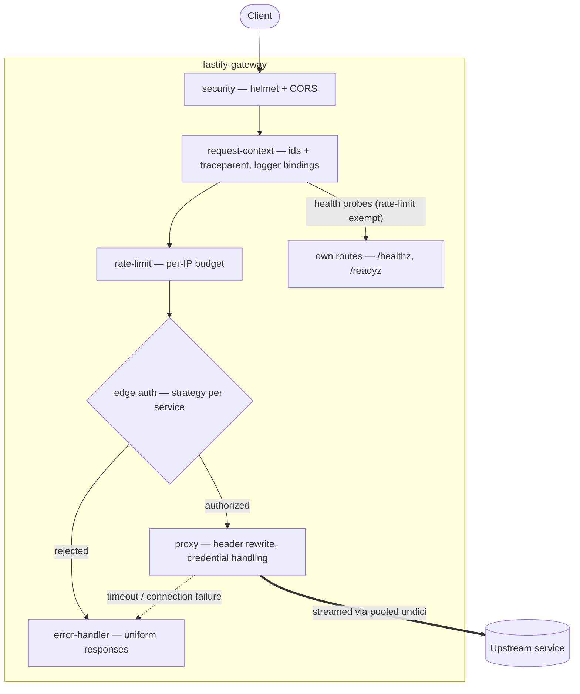
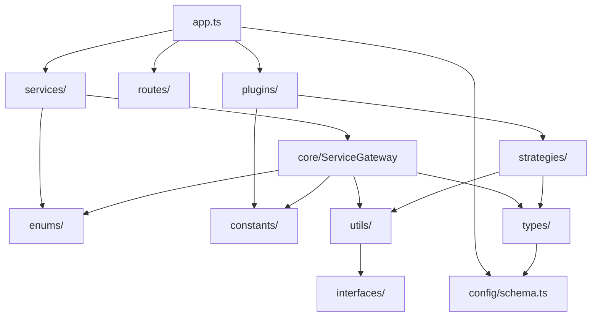

# Architecture

## Request lifecycle



Requests to `routes/` (health probes) are answered by the gateway itself.
Requests to `services/` prefixes are authenticated, rewritten, and streamed to
the owning upstream. Errors anywhere in the pipeline produce the uniform error
shape described in [Operations](operations.md).

## Project layout

```
src/
├── app.ts                     composition root — registration order lives here
├── server.ts                  entry point — listen, OTel bootstrap, shutdown
├── otel.ts                    OpenTelemetry SDK bootstrap (feature-flagged)
├── config/
│   ├── schema.ts              env schema, validated by @fastify/env at boot
│   └── env.ts                 fail-fast readers for pre-schema factory options
├── constants/                 header names, HTTP statuses/methods, messages
├── enums/                     enum-like const objects (AuthScheme, AlertLevel, …)
├── interfaces/                object shapes (ErrorBody, TraceContext, AlertChannel)
├── types/                     type aliases + ambient Fastify augmentation
│   ├── gateway-config.type.ts GatewayConfig, derived from the env schema
│   └── fastify.d.ts           typings for runtime decorators
├── utils/                     pure helpers (crypto, auth parsing, tracing, alerts, …)
├── strategies/                edge auth strategies — api-key, basic, jwt, bearer
├── core/
│   └── service-gateway.ts     abstract ServiceGateway + toPlugin() bridge
├── plugins/                   cross-cutting concerns, applied app-wide
│   ├── security.ts            helmet + CORS
│   ├── request-context.ts     correlation ids + trace propagation
│   ├── auth.ts                the auth strategy registry
│   ├── rate-limit.ts          per-IP limiter (in-memory or Redis)
│   ├── error-handler.ts       uniform error and 404 responses
│   ├── metrics.ts             Prometheus metrics collection
│   └── alerts.ts              Slack/Discord alerting (feature-flagged)
├── routes/                    endpoints the gateway serves itself
│   ├── health.ts              /healthz, /readyz
│   └── metrics.ts             /metrics
└── services/                  endpoints the gateway proxies — one class each
```

The organizing idea is the `routes/` vs `services/` split: **`routes/` is what
the gateway answers; `services/` is what it forwards.**

`constants/`, `enums/`, `interfaces/`, `types/`, `utils/`, and `strategies/`
each expose a barrel (`index.ts`); consumers import from the folder
(`import { Header } from "@/constants"`), so internal file moves never ripple.

## Module dependencies

Arrows point from importer to imported. Dependencies flow strictly downward —
there are no cycles:



## Composition root

Everything is registered explicitly in `app.ts`, so the composition of the
gateway reads top to bottom in one file. Registration order is load-bearing:

1. `env` — validates configuration, decorates `fastify.config`
2. Plugins — cross-cutting concerns, wrapped in `fastify-plugin` so they apply
   app-wide
3. Routes — the gateway's own endpoints
4. Services — one encapsulated proxy per upstream

Fastify readies each awaited subtree before the next starts, so services can
rely on `fastify.config` and the auth strategy registry already existing.

## Encapsulation model

Plugins are `fastify-plugin`-wrapped: their hooks and decorators apply to the
whole application, proxied routes included. Service proxies are **not**
wrapped, so each lands in its own encapsulated context — a hook or decorator
added for one service cannot leak into another.

## Path aliases and the build pipeline

Modules import through `@/` aliases (`@/utils`, `@/constants`; tests use
`@test/*`), declared once in `tsconfig.json` `paths`. There are no relative
`../../` chains and no file extensions in import specifiers.

| Context | Resolver |
| --- | --- |
| Development (`tsx`) | Reads tsconfig paths natively |
| Tests (vitest) | Mirrors the paths via `resolve.alias` |
| Production build | `tsc-alias` rewrites aliases to relative specifiers in `dist/` |

The shipped `dist/` output is plain, spec-compliant ESM — production runs on
stock Node.js with no runtime resolver.

## Design decisions

**A class per service.** `ServiceGateway` holds all shared proxy behavior;
each service is a small subclass declaring *what* to proxy. A service that
needs its own timeout, header policy, or auth scheme overrides one member
instead of branching shared code. See [Extending](extending.md).

**Explicit registration over convention loading.** Autoloading directories
trades visibility for convenience; a gateway's composition is small enough
that one readable file wins.

**Constants over raw literals.** Header names, status codes, and client-facing
messages live in `constants/`; auth schemes in `enums/`. The `GatewayConfig`
type is derived from the validation schema, so configuration has a single
source of truth.

**`as const` objects instead of TypeScript enums.** The project enforces
`erasableSyntaxOnly`: all type syntax is erasable, keeping the source directly
runnable by Node's native type stripping. `enum` generates runtime code and is
deliberately excluded.

**Streaming, not buffering.** Proxied request and response bodies stream
through pooled undici connections. `BODY_LIMIT` applies only to routes the
gateway parses itself.

**Feature-flagged, dynamically-loaded extras.** Redis rate limiting, chat
alerting, and OpenTelemetry are opt-in and off by default. Where a feature
pulls heavy dependencies — notably OpenTelemetry — they are imported
dynamically only when the flag is on, so a disabled feature costs nothing at
startup and never enters the module graph.
