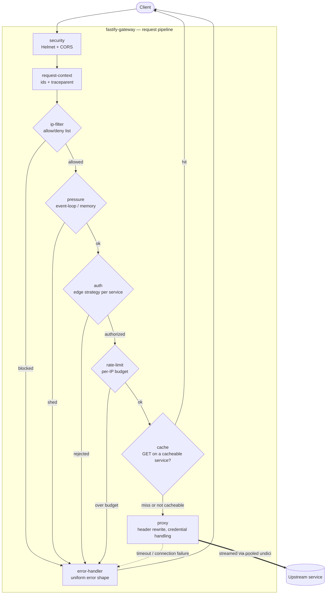
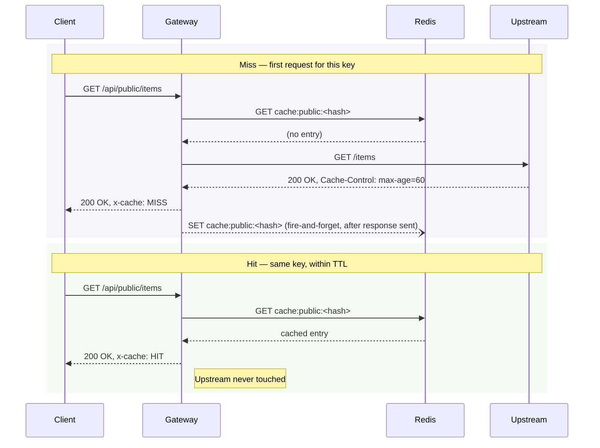
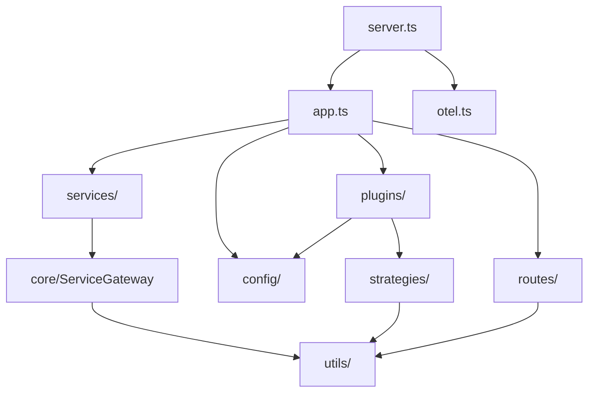

# Architecture

## Request lifecycle

Plugins register in a fixed, load-bearing order (see [Composition
root](#composition-root)). Most only observe or decorate a request; five
**gate** it and can short-circuit the pipeline: `ip-filter`, `pressure`,
`auth`, `rate-limit`, and `cache` (a hit returns immediately, without ever
reaching the proxy):



`logging`, `redis`, `metrics`, and `alerts` observe every request — binding
log fields, backing the rate limiter and cache, recording histograms, and
notifying on high-severity responses — without gating it; they are omitted
above for clarity. Requests to `routes/` (health probes, `/metrics`) are
answered by the gateway itself and skip most of this pipeline: health probes
are exempt from `ip-filter`, `pressure`, and `rate-limit` so an outage can
never fail liveness into a restart loop; `/metrics` is exempt from
`pressure` and `rate-limit` but deliberately **not** `ip-filter`, since a
blocked scrape is visible and recoverable. Requests to `services/` prefixes
run the full pipeline and are streamed to the owning upstream. Errors
anywhere in the pipeline produce the uniform error shape described in
[Operations](operations.md).

## Response caching flow

Caching (feature flag `CACHE_ENABLED`) sits between `rate-limit` and `proxy`
above, and is decided per service (see [Extending → Override
points](extending.md#override-points), `cacheable`). A miss stores the
response **after** it has already been sent to the client — the store never
adds latency to the response path:



The cache key hashes the URL plus the `accept`/`accept-encoding` request
headers, scoped per service. Credentialed requests (`Authorization` or
`Cookie` present) always bypass the cache — a shared cache must never serve
one client's response to another. Redis errors and slow lookups fail open:
a cache outage degrades to a plain proxy, never an outage of its own. See
[Configuration → Response caching](configuration.md#response-caching) for
the TTL and size rules.

## Project layout

```
src/
├── app.ts                     composition root — registration order lives here
├── server.ts                  entry point — listen, OTel bootstrap, shutdown
├── otel.ts                    OpenTelemetry SDK bootstrap (feature-flagged)
├── config/
│   ├── schema.ts              env schema, validated by @fastify/env at boot
│   └── env.ts                 fail-fast readers for pre-schema factory options
├── constants/                 header names, HTTP statuses/methods, messages
├── enums/                     enum-like const objects (AuthScheme, AlertLevel, …)
├── interfaces/                object shapes (ErrorBody, TraceContext, AlertChannel)
├── types/                     type aliases + ambient Fastify augmentation
│   ├── gateway-config.type.ts GatewayConfig, derived from the env schema
│   └── fastify.d.ts           typings for runtime decorators
├── utils/                     pure helpers (crypto, auth parsing, tracing, alerts, …)
├── strategies/                edge auth strategies — api-key, basic, jwt, bearer
├── core/
│   └── service-gateway.ts     abstract ServiceGateway + toPlugin() bridge
├── plugins/                   cross-cutting concerns, applied app-wide
│   ├── security.ts            helmet + CORS
│   ├── request-context.ts     correlation ids + trace propagation
│   ├── logging.ts             hook-based logging: flush on close, request lines, slow warns
│   ├── ip-filter.ts           IP allow/deny lists (CIDR-aware)
│   ├── pressure.ts            load shedding via @fastify/under-pressure
│   ├── auth.ts                the auth strategy registry
│   ├── redis.ts               shared managed Redis client (feature-flagged)
│   ├── rate-limit.ts          per-IP limiter (in-memory or Redis)
│   ├── cache.ts               response caching for opted-in services (feature-flagged)
│   ├── error-handler.ts       uniform error and 404 responses
│   ├── metrics.ts             Prometheus metrics collection
│   └── alerts.ts              Slack/Discord alerting (feature-flagged)
├── routes/                    endpoints the gateway serves itself
│   ├── health.ts              /healthz, /readyz
│   └── metrics.ts             /metrics
└── services/                  endpoints the gateway proxies — one class each
```

The organizing idea is the `routes/` vs `services/` split: **`routes/` is what
the gateway answers; `services/` is what it forwards.**

`constants/`, `enums/`, `interfaces/`, `types/`, `utils/`, and `strategies/`
each expose a barrel (`index.ts`); consumers import from the folder
(`import { Header } from "@/constants"`), so internal file moves never ripple.

## Module dependencies

Arrows point from importer to imported. Dependencies flow strictly downward —
there are no cycles:



Every layer shown may additionally import from `constants/`, `enums/`,
`types/`, and `interfaces/` — the foundation layer, each with no
dependencies of its own except `interfaces/`, which imports `enums/`.
Omitted above for readability; none of them import back up, so they never
introduce a cycle. `otel.ts` has no internal dependencies at all — it is
loaded dynamically, only when `OTEL_ENABLED` is set, and imports only the
`@opentelemetry/*` packages directly.

## Composition root

Everything is registered explicitly in `app.ts`, so the composition of the
gateway reads top to bottom in one file. Registration order is load-bearing:

1. `env` — validates configuration, decorates `fastify.config`
2. Plugins — cross-cutting concerns, wrapped in `fastify-plugin` so they apply
   app-wide
3. Routes — the gateway's own endpoints
4. Services — one encapsulated proxy per upstream

Fastify readies each awaited subtree before the next starts, so services can
rely on `fastify.config` and the auth strategy registry already existing.

## Encapsulation model

Plugins are `fastify-plugin`-wrapped: their hooks and decorators apply to the
whole application, proxied routes included. Service proxies are **not**
wrapped, so each lands in its own encapsulated context — a hook or decorator
added for one service cannot leak into another.

## Path aliases and the build pipeline

Modules import through `@/` aliases (`@/utils`, `@/constants`; tests use
`@test/*`), declared once in `tsconfig.json` `paths`. There are no relative
`../../` chains and no file extensions in import specifiers.

| Context | Resolver |
| --- | --- |
| Development (`tsx`) | Reads tsconfig paths natively |
| Tests (vitest) | Mirrors the paths via `resolve.alias` |
| Production build | `tsc-alias` rewrites aliases to relative specifiers in `dist/` |

The shipped `dist/` output is plain, spec-compliant ESM — production runs on
stock Node.js with no runtime resolver.

## Design decisions

**A class per service.** `ServiceGateway` holds all shared proxy behavior;
each service is a small subclass declaring *what* to proxy. A service that
needs its own timeout, header policy, or auth scheme overrides one member
instead of branching shared code. See [Extending](extending.md).

**Explicit registration over convention loading.** Autoloading directories
trades visibility for convenience; a gateway's composition is small enough
that one readable file wins.

**Constants over raw literals.** Header names, status codes, and client-facing
messages live in `constants/`; auth schemes in `enums/`. The `GatewayConfig`
type is derived from the validation schema, so configuration has a single
source of truth.

**`as const` objects instead of TypeScript enums.** The project enforces
`erasableSyntaxOnly`: all type syntax is erasable, keeping the source directly
runnable by Node's native type stripping. `enum` generates runtime code and is
deliberately excluded.

**Streaming, not buffering.** Proxied request and response bodies stream
through pooled undici connections. `BODY_LIMIT` applies only to routes the
gateway parses itself.

**Feature-flagged, dynamically-loaded extras.** Redis rate limiting, chat
alerting, and OpenTelemetry are opt-in and off by default. Where a feature
pulls heavy dependencies — notably OpenTelemetry — they are imported
dynamically only when the flag is on, so a disabled feature costs nothing at
startup and never enters the module graph.
