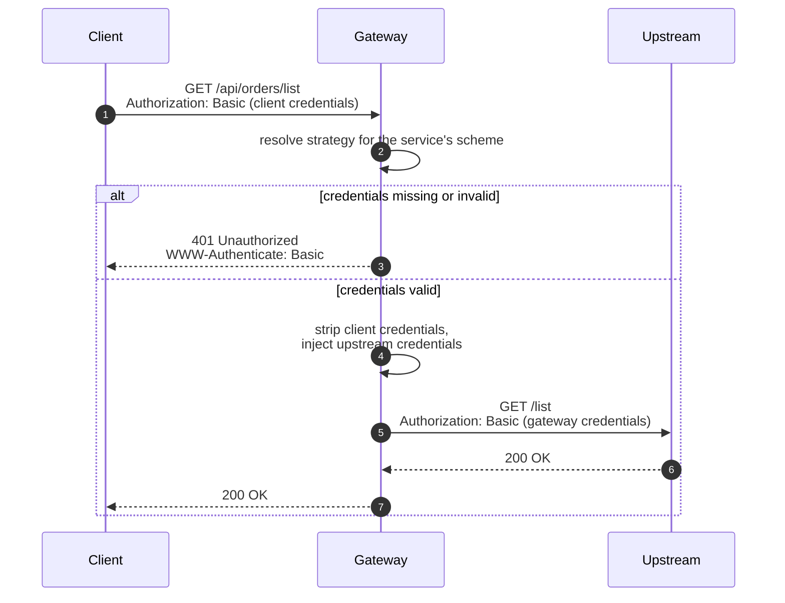

# Authentication

The gateway authenticates in two directions: **edge** (client → gateway) and
**upstream** (gateway → service). Verifying credentials once at the edge lets
upstreams trust traffic that arrives from the gateway.



## Edge authentication

Each service declares one scheme:

| Scheme | Credential | Header |
| --- | --- | --- |
| `api-key` | Shared secret (`GATEWAY_API_KEY`) | `x-api-key` |
| `basic` | User list (`BASIC_AUTH_USERS`) | `Authorization: Basic …` |
| `jwt` | HMAC secret or JWKS (`JWT_SECRET` / `JWT_JWKS_URI`) | `Authorization: Bearer …` |
| `none` | — | — |

The `jwt` scheme verifies a signed token's signature and expiry, plus any
configured issuer (`JWT_ISSUER`) and audience (`JWT_AUDIENCE`) claims, using
either a shared HMAC secret (HS256) or a remote JWKS endpoint (RS256/ES256).

All credential comparisons are constant-time (`crypto.timingSafeEqual`).
Unknown-username lookups in Basic auth are equalized against a dummy secret,
so timing cannot distinguish existing from non-existing users.

### Failure behavior

| Situation | Response |
| --- | --- |
| Missing or wrong credential | `401` with the uniform error body |
| Failed Basic auth | `401` plus a `WWW-Authenticate: Basic` challenge |
| Scheme enabled but not configured (empty key or user list) | `500 Gateway misconfigured` — a misconfigured gateway never silently allows traffic |
| Service references a scheme with no registered strategy | Startup failure, not a runtime surprise |

## Upstream (service-to-service) authentication

A service may declare credentials the gateway presents to its upstream:

```ts
protected upstreamCredentials(config: GatewayConfig) {
  return config.USERS_SERVICE_BASIC_AUTH || undefined;
}
```

When set, the gateway sends them as `Authorization: Basic …` (encoded once at
boot, injected per request), replacing any client-supplied Authorization
value. Upstreams can then require credentials that only the gateway holds.

## Header hygiene

What reaches the upstream, by design:

| Header | Rule |
| --- | --- |
| `x-api-key` | Always stripped — the gateway's edge credential never leaves the edge |
| `Authorization` | Stripped when edge auth consumed it (Basic); replaced when upstream credentials are configured; otherwise **passed through**, so client bearer tokens keep working on `none` and `api-key` services |
| `x-forwarded-for` / `-host` / `-proto` | Appended/set on every proxied request |

A custom scheme that reads `Authorization` should override
`consumesAuthorizationHeader()` — see below.

## Custom schemes

The built-in schemes (`api-key`, `basic`, `jwt`) are themselves factories in
`src/strategies/`; new ones follow the same shape. A strategy is a factory
producing an `AuthStrategy` (a Fastify preHandler), registered in the strategy
registry. For example, an opaque-token introspection scheme:

```ts
// src/strategies/opaque-token.strategy.ts
import type { AuthStrategy } from "@/types";
import { parseBearerToken, sendUnauthorized } from "@/utils";

export function createOpaqueTokenStrategy(introspect: (token: string) => Promise<boolean>): AuthStrategy {
  return async (req, reply) => {
    const token = parseBearerToken(req.headers.authorization);
    if (!token || !(await introspect(token))) return sendUnauthorized(req, reply);
  };
}
```

Register it (in `plugins/auth.ts`, or any plugin registered after it):

```ts
fastify.registerAuthStrategy(AuthScheme.Opaque, createOpaqueTokenStrategy(introspect));
```

Add the scheme value to `src/enums/auth-scheme.enum.ts`, and reference it from
a service. Nothing in the proxy core or the existing strategies changes.
Registering a scheme twice throws, so overrides are always explicit; a service
referencing an unregistered scheme fails at boot with the service name.

If the custom scheme consumes the `Authorization` header, override the
service's `consumesAuthorizationHeader()` so the credential is stripped before
proxying.
