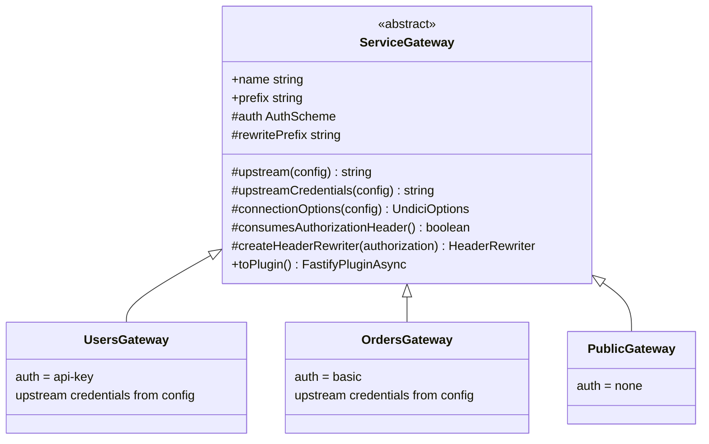

# Extending

The gateway is designed so that growth means *adding* files, not modifying
existing ones.

## Adding a service

1. **Declare the upstream** in `src/config/schema.ts`:

   ```ts
   BILLING_SERVICE_URL: { type: "string", default: "http://localhost:3004" },
   ```

   The `GatewayConfig` type picks it up automatically.

2. **Create the service class** in `src/services/`:

   ```ts
   // src/services/billing.gateway.ts
   import { ServiceGateway } from "@/core/service-gateway";
   import { AuthScheme } from "@/enums";
   import type { GatewayConfig } from "@/types";

   export class BillingGateway extends ServiceGateway {
     readonly name = "billing";
     readonly prefix = "/api/billing";
     protected readonly auth = AuthScheme.ApiKey;

     protected upstream(config: GatewayConfig) {
       return config.BILLING_SERVICE_URL;
     }
   }

   export default new BillingGateway().toPlugin();
   ```

3. **Register it** in `src/app.ts`:

   ```ts
   await app.register(billingGateway);
   ```

Requests to `/api/billing/*` are now authenticated, rewritten, and proxied
with the same pooling, timeouts, tracing, and header hygiene as every other
service.

## Override points

`ServiceGateway` splits proxy behavior into focused, overridable members. A
service customizes exactly the step it needs:



| Member | Default | Override to |
| --- | --- | --- |
| `auth` | `AuthScheme.None` | Require an edge auth scheme |
| `rewritePrefix` | `"/"` (strips the public prefix) | Mount the upstream path differently |
| `upstreamCredentials(config)` | `undefined` | Present Basic credentials to the upstream |
| `connectionOptions(config)` | Pool/timeouts from config | Give this service its own pool size or timeouts |
| `consumesAuthorizationHeader()` | `true` only for Basic | Control whether client `Authorization` reaches the upstream |
| `createHeaderRewriter(auth)` | Forwarded headers + credential hygiene | Fully custom header policy |

Example — a service with a tighter timeout budget:

```ts
protected connectionOptions(config: GatewayConfig) {
  return { ...super.connectionOptions(config), headersTimeout: 2_000, bodyTimeout: 2_000 };
}
```

## Adding an auth scheme

Full guide in [Authentication](authentication.md#custom-schemes). In short:

1. Add the value to `src/enums/auth-scheme.enum.ts`.
2. Create a strategy factory in `src/strategies/`.
3. Register it: `fastify.registerAuthStrategy(scheme, strategy)`.

Existing services, strategies, and the proxy core stay untouched. Duplicate
registrations throw; unregistered references fail at boot.

## Conventions to keep

- **Imports** — always `@/` aliases via the folder barrels; no relative
  `../../` chains, no file extensions.
- **File naming** — `*.constants.ts`, `*.enum.ts`, `*.interface.ts`,
  `*.type.ts`, `*.util.ts`, `*.strategy.ts`, `*.gateway.ts`.
- **Configuration** — every value goes through the schema; never read
  `process.env` outside the factory options in `app.ts`.
- **Comments** — JSDoc blocks on exported declarations and members; `//` for
  internal notes; nothing that repeats the code.
- **No raw literals** — header names from `@/constants` (`Header`), statuses
  from `HttpStatus`, client messages from `ErrorMessage`, schemes from
  `AuthScheme`.
- **Tests accompany behavior** — see [Testing](testing.md).
