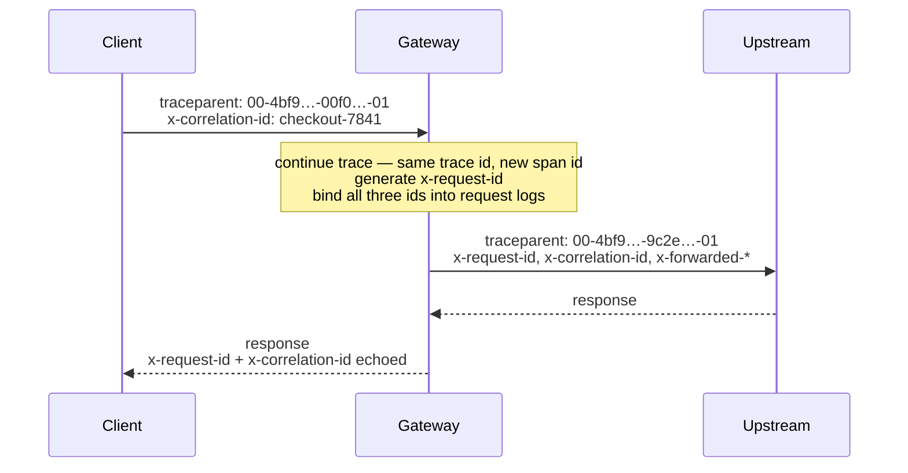

# Observability

Every request carries three correlation ids. All three are bound into every
log line for the request, forwarded to the upstream, and (except
`traceparent`) echoed on the response.



## The three ids

| Header | Scope | Behavior |
| --- | --- | --- |
| `x-request-id` | One hop | Honored from the client when it matches a safe shape (`[\w.-]{1,128}`), otherwise generated as a UUID. Unsafe values are replaced to keep logs injection-free. Echoed on the response. |
| `x-correlation-id` | A whole business transaction | Honored when it matches the same safe shape as the request id, otherwise defaults to the request id. Echoed on the response. |
| `traceparent` | W3C Trace Context | A valid incoming trace is **continued**: same trace id, fresh span id, flags preserved. An absent or invalid header starts a new sampled trace. Forwarded upstream. |
| `tracestate` | W3C vendor state | Forwarded unchanged (within the 512-byte spec bound) **only** alongside a continued trace; dropped when a new trace is started, since it would reference a trace the gateway did not continue. |

Because the gateway speaks W3C Trace Context, it composes with any
OpenTelemetry-instrumented services without carrying the OTel SDK itself.
Invalid `traceparent` values (wrong shape, version `ff`, all-zero ids) are
replaced, never forwarded.

## Logging

Structured JSON logging via Pino (Fastify's built-in logger), in a standard
format: ISO-8601 timestamps and string level labels (`info`, `warn`, `error`).

### Channels

`LOG_DESTINATION` selects where logs go — a single channel or a
comma-separated combination (`console,file` logs to both at once, in the
same format):

- **`console`** (default) — line-delimited JSON to stdout. Correct for
  containers, where the platform (Docker/Kubernetes) handles rotation and
  retention. This is the recommended setup on Kubernetes.
- **`file`** — a rotating file via `pino-roll`. Rotation is triggered by size
  (`LOG_ROTATION_MAX_SIZE`) or interval (`LOG_ROTATION_FREQUENCY`), and old
  files are pruned automatically to keep the most recent `LOG_RETENTION_FILES`.
  Use this for VM or bare-metal deployments without a log shipper.

`LOG_BUFFER_BYTES` (default 0) batches stdout writes asynchronously until
that many bytes accumulate — a throughput lever at high request rates.
Orderly shutdown flushes the buffer (the logging plugin also flushes on
`close`); a hard crash can lose the buffered tail.

### Request logging

`LOG_REQUEST_STYLE` selects the per-request logging style:

- **`fastify`** (default) — Fastify's built-in two lines per request
  (incoming + completed).
- **`single`** — one structured completion line per request with `method`,
  `url`, matched `route`, `statusCode`, `elapsedMs`, and `ip` — half the log
  volume at gateway request rates.
- **`off`** — no per-request lines; errors are still logged by the error
  handler.

`SLOW_REQUEST_MS` (default 0 = off) additionally logs a warn-level
`slow request` line for any request exceeding the threshold — cheap
latency-outlier visibility without tracing.

### Fields

- Every request log line carries `reqId`, `correlationId`, and `traceId`
  bindings — grep any one id to reconstruct a request's story.
- Service registrations are logged at boot with prefix, upstream, and auth
  scheme.
- Upstream failures log the underlying error at `error` level; client
  rejections (4xx) log at `info` without stack noise.

Example (formatted for readability):

```json
{
  "level": "info",
  "time": "2026-08-13T10:18:19.677Z",
  "reqId": "3f1a…",
  "correlationId": "checkout-7841",
  "traceId": "4bf92f3577b34da6a3ce929d0e0e4736",
  "msg": "request completed"
}
```

### Redaction

`authorization`, `x-api-key`, and `cookie` request headers are redacted from
all log output. Credentials never appear in logs regardless of log level.

### Level

Set `LOG_LEVEL` (`fatal` | `error` | `warn` | `info` | `debug` | `trace` |
`silent`). Default is `info`.

## Metrics

Beyond logs and traces, the gateway serves Prometheus metrics at
`GET /metrics` — request counts and duration histograms labeled by method,
route pattern (bounded — never the raw URL), and status, plus Node.js process
metrics. The endpoint can require a bearer token (`METRICS_TOKEN`).
Deployment guidance lives in [Operations → Metrics](operations.md#metrics).

## Chat alerting

Optional chat notifications, off by default (feature flag `ALERTS_ENABLED`).
One channel is active at a time, chosen by `ALERT_CHANNEL` (`slack`,
`discord`, or `none`); the selected channel's webhook (`SLACK_WEBHOOK_URL` or
`DISCORD_WEBHOOK_URL`) receives a message on every response at or above the
`ALERT_LEVEL` threshold — `error` (5xx only, the default) or `warn` (4xx and
5xx). The message carries the derived severity and includes the status,
method, route pattern, and request id. Notifications are throttled
to one per `ALERT_THROTTLE_MS` (default 60s) so a burst of errors cannot flood
the channel. Delivery is retried with exponential backoff (`ALERT_RETRIES`),
runs after the response is sent so it never affects the client, and a webhook
that fails every attempt is logged rather than raised.

This is a lightweight signal for humans; for full metric-based alerting,
scrape `/metrics` with Prometheus (or export traces via OpenTelemetry, below)
and alert there.

## OpenTelemetry

Optional OpenTelemetry tracing, off by default (feature flag `OTEL_ENABLED`).
When enabled, the gateway starts the OpenTelemetry Node SDK before loading the
application, instruments incoming HTTP, the undici upstream calls, and Fastify,
and exports spans over OTLP/HTTP. This emits real spans to a collector,
complementing the gateway's native W3C trace-context propagation (which works
with or without the SDK).

The exporter and sampling are configured through the standard `OTEL_*`
environment variables:

| Variable | Purpose |
| --- | --- |
| `OTEL_ENABLED` | Feature flag (`true` to start the SDK) |
| `OTEL_SERVICE_NAME` | Service name on emitted spans (default `fastify-gateway`) |
| `OTEL_EXPORTER_OTLP_ENDPOINT` | Collector endpoint, e.g. `http://otel-collector:4318` |

The SDK and its dependencies are imported dynamically, so nothing loads when
the flag is off. If no collector is reachable, the SDK logs export failures
but the gateway continues to serve normally.
