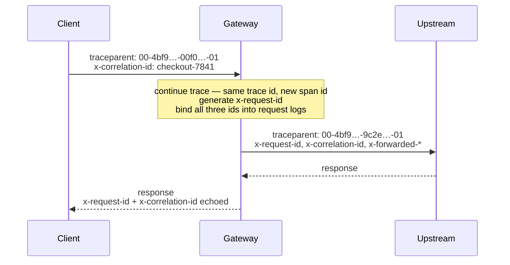

# Observability

Every request carries three correlation ids. All three are bound into every
log line for the request, forwarded to the upstream, and (except
`traceparent`) echoed on the response.



## The three ids

| Header | Scope | Behavior |
| --- | --- | --- |
| `x-request-id` | One hop | Honored from the client when it matches a safe shape (`[\w.-]{1,128}`), otherwise generated as a UUID. Unsafe values are replaced to keep logs injection-free. Echoed on the response. |
| `x-correlation-id` | A whole business transaction | Honored when it matches the same safe shape as the request id, otherwise defaults to the request id. Echoed on the response. |
| `traceparent` | W3C Trace Context | A valid incoming trace is **continued**: same trace id, fresh span id, flags preserved. An absent or invalid header starts a new sampled trace. Forwarded upstream. |
| `tracestate` | W3C vendor state | Forwarded unchanged (within the 512-byte spec bound) **only** alongside a continued trace; dropped when a new trace is started, since it would reference a trace the gateway did not continue. |

Because the gateway speaks W3C Trace Context, it composes with any
OpenTelemetry-instrumented services without carrying the OTel SDK itself.
Invalid `traceparent` values (wrong shape, version `ff`, all-zero ids) are
replaced, never forwarded.

## Logging

Structured JSON logging via Pino (Fastify's built-in logger).

- Every request log line carries `reqId`, `correlationId`, and `traceId`
  bindings — grep any one id to reconstruct a request's story.
- Service registrations are logged at boot with prefix, upstream, and auth
  scheme.
- Upstream failures log the underlying error at `error` level; client
  rejections (4xx) log at `info` without stack noise.

Example (formatted for readability):

```json
{
  "level": 30,
  "reqId": "3f1a…",
  "correlationId": "checkout-7841",
  "traceId": "4bf92f3577b34da6a3ce929d0e0e4736",
  "msg": "request completed"
}
```

### Redaction

`authorization`, `x-api-key`, and `cookie` request headers are redacted from
all log output. Credentials never appear in logs regardless of log level.

### Level

Set `LOG_LEVEL` (`fatal` | `error` | `warn` | `info` | `debug` | `trace` |
`silent`). Default is `info`.

## Metrics

Beyond logs and traces, the gateway serves Prometheus metrics at
`GET /metrics` — request counts and duration histograms labeled by method,
route pattern (bounded — never the raw URL), and status, plus Node.js process
metrics. The endpoint can require a bearer token (`METRICS_TOKEN`).
Deployment guidance lives in [Operations → Metrics](operations.md#metrics).

## Alerting

Ready-to-use Prometheus scrape configuration and alerting rules ship in
[`deploy/monitoring/`](../deploy/monitoring/README.md), in both Prometheus
Operator (`PrometheusRule` / `ServiceMonitor`) and plain-Prometheus formats.
The rules cover availability, 5xx and upstream-failure rates, p99 latency,
rate-limit spikes, and process health (event-loop lag, heap), each with a
severity and a first-response note.
