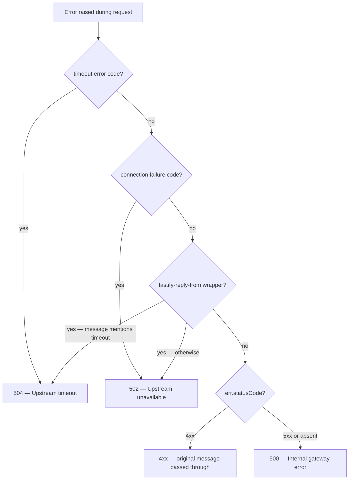

# Operations

Running the gateway in production: error semantics, resource limits, and
scaling.

## Error semantics

Every error response has the same body:

```json
{ "error": "<client-safe message>", "requestId": "<id>" }
```

| Status | Meaning | Trigger |
| --- | --- | --- |
| `502 Upstream unavailable` | Upstream unreachable | Connection refused/reset, DNS failure |
| `504 Upstream timeout` | Upstream too slow | Connect or response timeout exceeded |
| `500 Internal gateway error` | Unexpected failure | Details logged, never sent to clients |
| `500 Gateway misconfigured` | Auth scheme enabled but not configured | See [Authentication](authentication.md) |
| `429` | Rate limit exceeded | Per-IP budget exhausted |
| `404 Not found` | No route matched | Uniform shape, includes request id |
| Other `4xx` | Client error | Original message passed through |

Upstream error details (addresses, error codes, stack traces) are logged with
full context but never appear in client responses.

How a raised error resolves to a status:



## Timeouts and connection pooling

Each service proxies through its own undici connection pool:

| Setting | Default | Variable |
| --- | --- | --- |
| Pool size | 128 | `UPSTREAM_MAX_CONNECTIONS` |
| TCP connect timeout | 2 s | `UPSTREAM_CONNECT_TIMEOUT_MS` |
| Response timeout (headers + body) | 10 s | `UPSTREAM_TIMEOUT_MS` |

Timeouts fail fast — a slow upstream costs one budget window, not a hung
connection. A service can override its own pool via `connectionOptions()`
([Extending](extending.md)).

There is deliberately **no circuit breaker**: timeouts bound each request, but
a persistently failing upstream is not tripped open. If you need one,
`@fastify/circuit-breaker` slots into the affected service's subclass.

## Rate limiting

Per-client-IP, in-memory: `RATE_LIMIT_MAX` requests per
`RATE_LIMIT_WINDOW_MS`. Health probes are exempt so orchestrator checks can
never exhaust a budget.

The in-memory store is correct for a single instance. When running replicas,
set `REDIS_URL` to a shared Redis so the limit applies across all of them —
nothing else changes, the gateway is otherwise stateless. On a Redis store
error the limiter fails open, so a Redis outage never takes the gateway
down.

## Deployment topology

- **Proxy trust** — `TRUST_PROXY` defaults to `true`, resolving `req.ip` from
  `x-forwarded-for`. When it is `false`, an incoming `x-forwarded-for` is
  treated as forged and replaced with the real peer before proxying (rather
  than appended), so upstreams never receive a client-controlled chain.
  Deploy behind a load balancer or proxy you trust, or set it to `false`.
- **Slow-client protection** — `REQUEST_TIMEOUT_MS` (default 30 s) bounds how
  long a single request may take to arrive, tighter than Node's ~5 min
  default.
- **Keep-alive** — `KEEP_ALIVE_TIMEOUT_MS` defaults to 72 s, above common
  load balancer idle timeouts (usually 60 s), so the LB never reuses a
  connection the gateway just closed.
- **Graceful shutdown** — on `SIGINT`/`SIGTERM` the gateway flips `/readyz`
  to `503 draining` (so load balancers route traffic away), stops accepting
  new connections, and drains in-flight requests. The drain is bounded by
  `SHUTDOWN_TIMEOUT_MS` (default 10 s); a hung upstream connection can never
  stall shutdown past the deadline.
- **Health probes** — `/healthz` (liveness) and `/readyz` (readiness), both
  auth-free and rate-limit-exempt. Readiness returns `503 draining` once
  shutdown begins.

## Metrics

`GET /metrics` serves Prometheus metrics: Node.js process defaults plus
`http_requests_total{method,route,status}` and
`http_request_duration_seconds{method,route,status}`. The `route` label is
the matched route pattern (e.g. `/api/users/*`), never the raw URL, so label
cardinality stays bounded.

Set `METRICS_TOKEN` to require `Authorization: Bearer <token>` on scrapes
(compared in constant time); leave it empty only when the endpoint is
isolated by network policy. The route is rate-limit-exempt, so a token is the
recommended protection against unauthenticated scraping. Default Node.js
process metrics (memory, CPU, event-loop lag, versions) are included, so
treat the endpoint as sensitive.

## Limitations

Explicitly out of scope today:

- **WebSocket proxying** — the proxy handles HTTP only; the underlying
  `@fastify/http-proxy` supports WebSockets if a service needs it
- **HTTP/2 upstreams** — upstream connections are HTTP/1.1 over pooled
  keep-alive sockets
- **Circuit breaking** — covered above; timeouts bound each request, but
  persistent failures are not tripped open
- **Body limits on proxied routes** — bodies stream through unbuffered;
  enforce size limits at the upstream or the load balancer
- **Host and path passthrough** — `x-forwarded-host` reflects the client
  `Host` header, and path segments (including `..`) reach the upstream
  unnormalized. Upstreams that build URLs from the forwarded host, or that do
  not normalize paths, should validate them; a service can pin an expected
  host by overriding `createHeaderRewriter`

## Security posture

Trust boundaries, credential handling, and the guarantees the gateway makes
are documented in the [Security Model](security-model.md).
