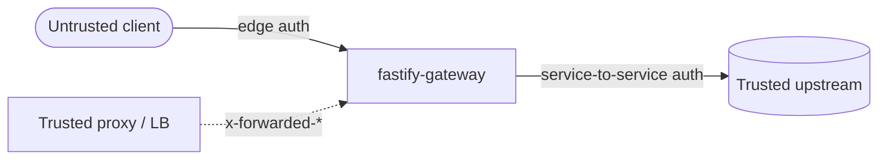

# Security Model

This document describes the gateway's trust boundaries, what it protects, and
where responsibility shifts to the operator or the upstream. For reporting
vulnerabilities, see [SECURITY.md](../SECURITY.md).

## Trust boundaries

- **Client → gateway** is the untrusted boundary. Every non-public request is
  authenticated here before anything is proxied.
- **Gateway → upstream** is trusted: upstreams may accept traffic on the basis
  that it passed the gateway, optionally verified by service-to-service
  credentials the gateway holds.
- **Proxy → gateway** (`x-forwarded-*`) is trusted only when `TRUST_PROXY` is
  true, i.e. a load balancer you control sits in front.

## What the gateway guarantees

**Authentication and credentials**

- Non-public services are authenticated at the edge; a service whose scheme is
  enabled but unconfigured fails **closed** (`500`), and a service naming an
  unregistered scheme fails at **boot**.
- All credential comparisons are constant-time over hashed inputs, so timing
  reveals neither content nor length, and Basic-auth timing does not reveal
  whether a username exists.
- The gateway's edge credential (`x-api-key`) is never forwarded upstream;
  client `Authorization` is stripped when consumed by edge auth or replaced by
  upstream credentials.
- Credentials are redacted from logs (`authorization`, `x-api-key`, `cookie`),
  and userinfo embedded in a service URL is stripped from the boot log.

**Request integrity and abuse resistance**

- Correlation and trace identifiers are validated against a safe character set
  before being logged or forwarded, preventing log/header injection.
- Per-IP rate limiting runs before edge auth, throttling credential brute
  force; `RATE_LIMIT_BAN` adds escalating lockout.
- A bounded `REQUEST_TIMEOUT_MS` resists slow-client attacks; upstream
  connect/response timeouts fail fast.
- Client-forged `x-forwarded-for` is replaced (not appended) when the proxy is
  untrusted.

**Configuration safety**

- Configuration is schema-validated and the process refuses to start on
  invalid values, including dangerous combinations (wildcard CORS with
  credentials), malformed or duplicate Basic users, non-URL upstreams, and
  malformed factory options that would otherwise silently disable a control.

**Transport and headers**

- Helmet security headers on every response; CORS restricted to an explicit
  origin allow-list (credentials off by default).

## What the operator is responsible for

- **TLS termination.** The gateway speaks HTTP; terminate TLS at the load
  balancer or a sidecar.
- **Proxy trust.** Set `TRUST_PROXY=false` when clients connect directly, or
  `x-forwarded-for` (and thus rate-limit keys) can be spoofed.
- **Strong secrets.** `GATEWAY_API_KEY`, `BASIC_AUTH_USERS`, `JWT_SECRET`, and
  `METRICS_TOKEN` must be high-entropy; the shipped `change-me` values are
  placeholders. Prefer `JWT_JWKS_URI` (asymmetric keys) over a shared HMAC
  secret where the identity provider supports it.
- **Metrics exposure.** `/metrics` reveals process and traffic information;
  set `METRICS_TOKEN` and/or restrict it by network policy.
- **Replica-wide rate limiting.** The in-memory limiter is per-instance; set
  `REDIS_URL` for a shared store when running replicas (see
  [Operations](operations.md)).
- **Alert and collector endpoints.** When alerting or OpenTelemetry are
  enabled, treat `SLACK_WEBHOOK_URL` / `DISCORD_WEBHOOK_URL` and the OTLP
  endpoint as trusted sinks reachable from the gateway.

## What upstreams remain responsible for

- **Path normalization.** Path segments (including `..`) are forwarded as
  received; upstreams must normalize their own paths.
- **Host-derived URLs.** `x-forwarded-host` reflects the client `Host`;
  upstreams that build absolute URLs from it should validate it (a service can
  pin an expected host by overriding `createHeaderRewriter`).
- **Body size limits.** Proxied bodies stream through unbuffered; upstreams (or
  the load balancer) enforce size limits.

## Explicit non-goals

WebSocket proxying, HTTP/2 upstreams, circuit breaking, and per-route body
limits on proxied paths are out of scope today — see
[Operations → Limitations](operations.md#limitations).
