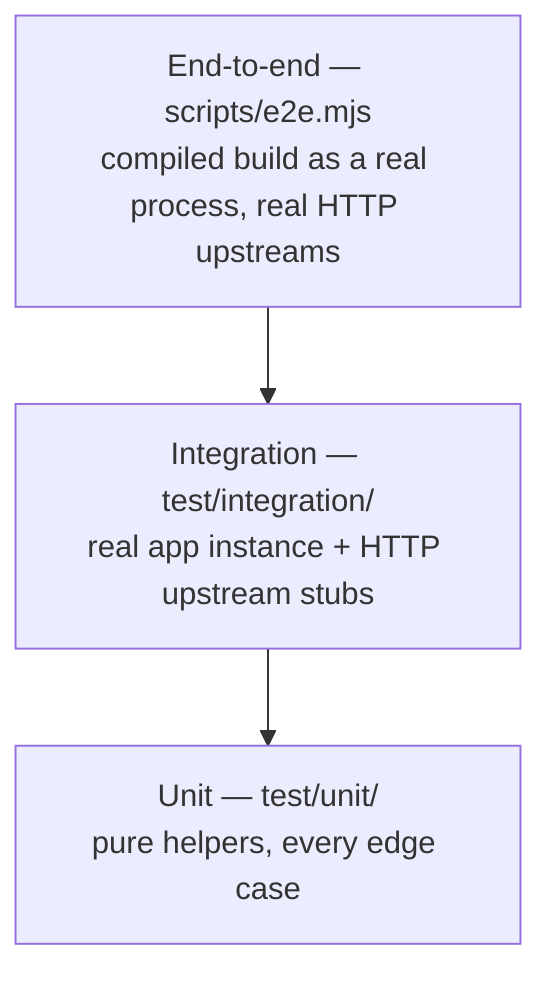

# Testing

The suite verifies the gateway at three layers, each catching what the layer
below cannot.



## Layers

| Layer | Location | What it proves | How |
| --- | --- | --- | --- |
| Unit | `test/unit/` | Pure helpers are correct at every edge case | Direct function calls (tracing, credential parsing, error mapping) |
| Integration | `test/integration/` | The composed gateway behaves correctly | Real app instance via `buildTestApp()`, real HTTP upstream stubs on ephemeral ports, requests injected through Fastify |
| End-to-end | `scripts/e2e.mjs` | The **compiled production build** works over the network | `dist/server.js` as a real process, real upstream services, real HTTP clients |

## Running

```bash
npm test               # unit + integration
npm run test:watch     # watch mode
npm run test:cov       # with V8 coverage
npm run test:debug     # inspector attached, serial execution
npm run test:e2e       # build, then the live end-to-end suite
```

CI runs lint, typecheck, the full test suite, and the end-to-end suite on
Node.js 20 and 22 for every push and pull request.

## What is covered

Integration tests exercise proxying (method/path/query/body forwarding,
prefix rewriting), both built-in auth schemes including misconfiguration and
malformed credentials, credential stripping and upstream injection, trace and
correlation propagation, upstream failures (dead upstream → 502, slow
upstream → 504), rate limiting and its health-probe exemption, CORS
allow-lists, and the custom-auth-scheme extension seam.

The e2e suite re-verifies every feature against the built artifact — including
log correlation, which only a real process can prove.

## Test helpers

| Helper | Purpose |
| --- | --- |
| `buildTestApp(overrides)` | Boots a ready gateway with test env defaults; overrides are applied to the environment for the build and restored after |
| `startUpstream(options)` | Minimal HTTP upstream capturing every request, with configurable status, body, headers, and response delay |
| `startServiceUpstreams()` | One echo upstream per demo service plus ready-made env overrides and a combined `closeAll()` |
| `deadUpstreamUrl()` | A URL that refuses connections, for failure-path tests |

## Writing tests

- **Assert the wire contract with literals.** Tests intentionally do not
  import the implementation's constants — if they shared them, a typo'd
  constant would pass on both sides. `expect(res.statusCode).toBe(401)` is
  correct; importing `HttpStatus.Unauthorized` in a test is not.
- **One behavior per test**, named for the behavior:
  `"rejects a wrong password"`, not `"test basic auth 2"`.
- **Boot real upstreams** rather than mocking the proxy layer; the helpers
  make this a one-liner and the tests then prove header traffic end to end.
- **Clean up** — close apps and upstreams in `afterAll`; upstream helpers
  force-close lingering connections.
- New behavior lands with tests for its success path, failure path, and
  boundary cases.
